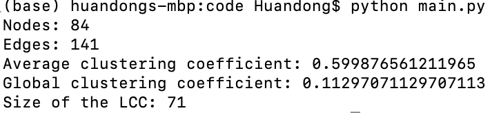
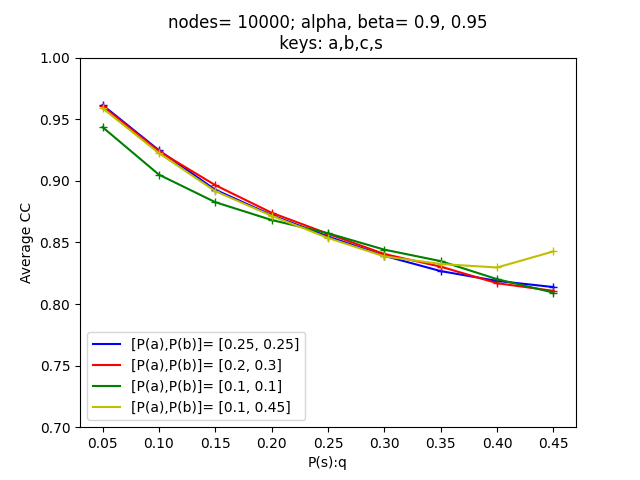
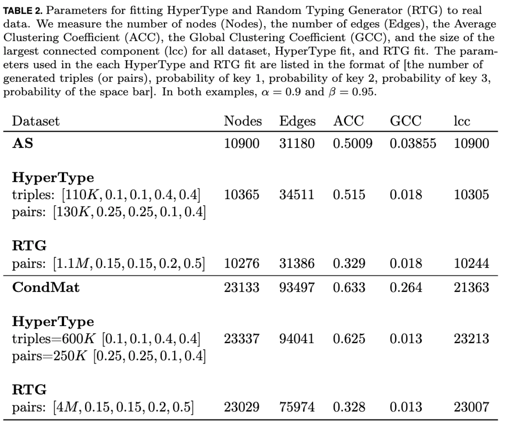

# The HyperType Model For Triangles in Networks
## Project Introduction
In this project, we introduce the HyperType network model that incorporates triangles, which is an extension of the Random Typing model designed by **Akoglu and Faloutsos** [[1]](#1). Any network generated by the HyperType model has important properties that real networks have, such as power-law degree distribution and power-law weight distribution. At the same time, our use of a probability tensor for nodes and edges generations gives the generated network a strong community structure and the property of non-trivial clustering coefficients absent from the original typing model. 

 
**Publication: Huandong Chang and Chuming Chen. “The Hypertype Model for Clustering in Networks”.
SIURO—SIAM. Vol 14. November 2021 doi: 10.1137/20S1369142**

Our paper is attached as [TypingModelPaper.pdf](TypingModelPaper.pdf) 

Sponsor: Nicole Eikmeier, Grinnell College (IA, USA) Department of Computer Science

## Run the Code

The codes here are the python implementations of the HyperType model. Make sure all the files in the src fold are in the same directory. Here are the introductions of each file:

##### initialization.py:

This file contains all the helper functions to initialize the HyperType model and part of the helper functions to initialize the Typing model. The user should not run this file.

##### Regularinitialization.py:

This file contains the remaining helper functions to initialize the Typing model besides those existing in initialization.py. The user should not run this file.

##### main.py:

We can adjust parameters, such as the probability list and the number of triples, in *main.py* to generate graphs using the HyperType model. Besides, if the user wants to combine the HyperType model with the Typing model, the user can include the function called *initialization2D()* in the file. Then the user should use the terminal to run *main.py* (*python main.py*). Then the information of the output graph, such as the number of nodes and the number of edges, will be returned in the terminal.

##### parameter.py

Since we can adjust the parameters in the HyperType model to better fit the real-world dataset, it is important to understand how certain graph properties, such as average clustering coefficient (acc), change with varying parameters. We can use *parameter.py* to realize this. 

## Fitting to Real Data
From the table, we can see that the  HyperType model is useful to be fit to real-world data.

## Reference
<a id="1">[1]</a> 
L. Akoglu and C. Faloutsos. Rtg: a recursive realistic graph generator using random typing. In Joint European Conference on Machine Learning and Knowledge Discovery in Databases, pp. 13–28. 2009.
